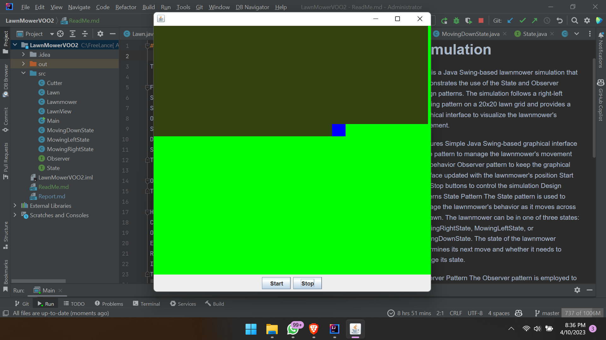

# Lawnmower Simulation

This is a Java Swing-based lawnmower simulation that demonstrates the use of the State and Observer design patterns. The simulation follows a right-left mowing pattern on a 20x20 lawn grid and provides a graphical interface to visualize the lawnmower's movement.

# Features
Simple Java Swing-based graphical interface
State pattern to manage the lawnmower's movement and behavior
Observer pattern to keep the graphical interface updated with the lawnmower's position
Start and Stop buttons to control the simulation
Design Patterns
State Pattern
The State pattern is used to manage the lawnmower's behavior as it moves across the lawn. The lawnmower can be in one of three states: MowingRightState, MowingLeftState, or MovingDownState. The state of the lawnmower determines its next move and whether it needs to change its state.

# Observer Pattern
The Observer pattern is employed to keep the graphical interface (LawnView) updated with the lawnmower's position on the lawn. The Lawnmower class acts as the subject, and the LawnView class acts as the observer. The Lawnmower class maintains a list of observers and notifies them whenever its position changes.

# How to run the project
Clone the repository or download the project source code.
Open the project in your preferred Java IDE (e.g., IntelliJ IDEA, Eclipse).
Ensure that the project is configured to use a JDK version 8 or above.
Run the Main class to start the simulation.
# Implementation
The program is implemented in Java and uses the following classes:

Lawn: Represents the lawn as a grid of rows and columns.
Lawnmower: Represents the lawnmower and manages its state and position on the lawn.
Cutter: A simple class that represents the cutting action of the lawnmower.
State: An interface implemented by the MowingRightState, MowingLeftState, and MovingDownState classes.
Observer: An interface implemented by the LawnView class.
LawnView: A Java Swing JFrame that displays the lawn and the lawnmower's position, as well as provides Start and Stop buttons to control the simulation.
Main: The main class that initializes the simulation and displays the LawnView.
#License
This project is available under the MIT License.